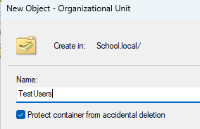
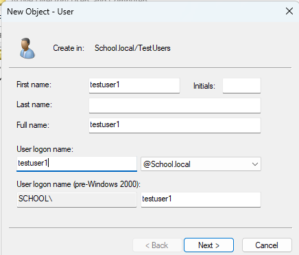
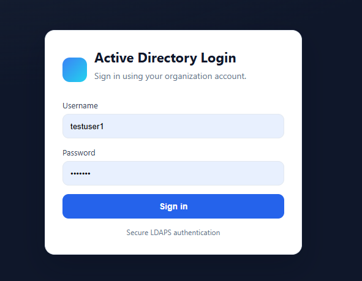
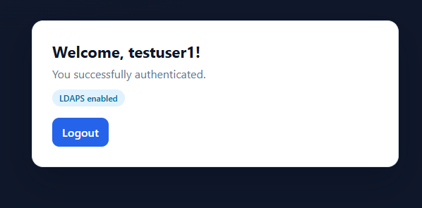
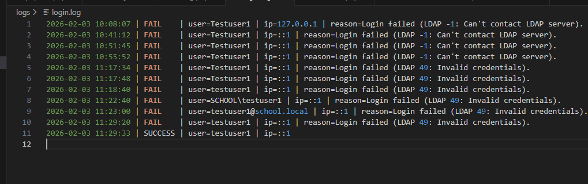

# Login with Active Directory (LDAPS)

A simple PHP login app that checks user credentials directly with Microsoft Active Directory over a secure LDAPS connection (LDAP over SSL/TLS). It includes a clean login UI, session-based access control, and audit logging.

## What This Project Means (Simple Explanation)
This project shows how infrastructure and programming work together:
- **Active Directory** stores all users in one central place.
- **The PHP app** does not store passwords. It asks AD: “Is this username and password correct?”
- If AD says “yes,” the user can access the welcome page.

This is how many real company apps work: one central login system (AD), many apps using it.

## Where LDAP/LDAPS Is Used
LDAP/LDAPS authentication is used in:
- Company web apps and internal portals
- VPN and Wi‑Fi authentication
- File servers and admin tools
- Single sign‑on systems

## What “Login via LDAP/LDAPS” Means
- **LDAP** (port 389) sends credentials in clear text.
- **LDAPS** (port 636) encrypts the connection with SSL/TLS.
The app sends the username and password to AD; AD validates them and returns success or failure.

## Features
- Secure AD authentication over LDAPS
- Session-based login/logout
- Friendly error messages
- Audit log of login attempts
- Clean, modern UI

## Project Structure
```
/login_with_AD
  /app
    config.php         # AD/LDAPS settings and base URL
    functions.php      # Helper functions (logging + LDAP auth)
  /public
    login.php          # Login page (UI)
    authenticate.php   # Handles login form submission
    welcome.php        # Protected page after login
    logout.php         # Ends session and returns to login
    phpinfo.php        # PHP configuration (debug only)
  /logs
    login.log          # Login attempt log file
```

## How It Works (High Level)
1. The user opens the login page.
2. The form posts credentials to the authentication endpoint.
3. The app binds to AD using LDAPS.
4. If credentials are valid, a session is created and the user is redirected to the welcome page.
5. If not valid, the app shows an error and writes a log entry.

## Requirements
- Windows Server with Active Directory (Domain Controller)
- XAMPP (Apache + PHP)
- PHP LDAP extension enabled
- LDAPS enabled on the Domain Controller (port 636)

## Development Environment
Built and edited in Visual Studio Code.

## Configuration
Edit [app/config.php](app/config.php):
- `AD_HOST` = your Domain Controller LDAPS URL (example: `ldaps://DC01.school.local`)
- `AD_PORT` = `636`
- `AD_DOMAIN` = your AD domain (example: `school.local`)
- `AD_BASE_DN` = optional for future LDAP searches
- `BASE_PATH` = URL path to the public folder (default: `/login_with_AD/public`)

## Step‑by‑Step Setup (Single‑Server Lab)
This assumes **everything runs on the server PC**:
- Windows Server + AD DS
- XAMPP + PHP app

### Step 1 — Prepare Windows Server (Why: stable identity)
1. Install Windows Server (2019/2022/2025).
2. Set a clear hostname (example: `DC01`).
3. Set a **static IP** (Domain Controllers must not use DHCP).
4. Set DNS to **itself** (server IP or 127.0.0.1).

### Step 2 — Install Active Directory (Why: central users)
1. Server Manager → Add Roles and Features.
2. Add **Active Directory Domain Services**.
3. Promote to Domain Controller.
4. Create a new forest (example domain: `school.local`).
5. Set the DSRM password and reboot.


*Add Roles and Features wizard (start).* 


*Selecting Active Directory Domain Services.*


*Installation confirmation step.*


*Domain/forest name selection.*

### Step 3 — Create Test Users (Why: you need accounts to log in)
1. Open **Active Directory Users and Computers**.
2. Create an OU (example: `TestUsers`).
3. Create users: `testuser1`, `testuser2` (with known passwords).
4. (Optional) Create a group `AppUsers` and add users.



*Organizational Unit created for test users.*


*Creating a new AD user.*



*User properties and logon details.*

### Step 4 — Install XAMPP (PHP + Apache)
1. Install XAMPP in `C:\xampp`.
2. Start Apache in the XAMPP Control Panel.
3. Open `http://localhost/` to confirm Apache works.

### Step 5 — Enable PHP LDAP (PHP must speak LDAP)
1. Open `C:\xampp\php\php.ini`.
2. Find `;extension=ldap` and change it to `extension=ldap`.
3. Restart Apache.
4. Verify with `phpinfo.php` that LDAP is enabled.


*Enabling the LDAP extension in PHP.*


*OpenSSL enabled (required for LDAPS).*

### Step 6 — Enable LDAPS (encrypted login)
LDAPS requires a valid TLS certificate on the Domain Controller.

**Self‑signed (lab) approach used in this project**:
1. **Create the certificate (PowerShell as Admin)**
  - Run this on the Domain Controller:
    - `New-SelfSignedCertificate -DnsName "DC01.school.local","DC01" -CertStoreLocation "cert:\LocalMachine\My" -KeySpec KeyExchange -NotAfter (Get-Date).AddYears(2) -TextExtension @("2.5.29.37={text}1.3.6.1.5.5.7.3.1")`
  - This creates a Server Authentication cert for LDAPS.
2. **Export it as Base‑64 (.cer)**
  - Open `mmc` → Add Snap‑in → Certificates (Local Computer).
  - Go to Personal → Certificates.
  - Find the cert with CN = `DC01.school.local`.
  - Right‑click → All Tasks → Export → **No private key** → Base‑64 (.CER).
3. **Convert to PEM for OpenSSL/PHP (if needed)**
  - `openssl x509 -in C:\xampp\php\extras\ssl\LDAPS_Cert.cer -inform DER -out C:\xampp\php\extras\ssl\LDAPS_Cert.pem -outform PEM`
4. **Tell PHP to trust it**
  - In `C:\xampp\php\php.ini` add:
    - `ldap.cafile="C:\xampp\php\extras\ssl\LDAPS_Cert.pem"`
5. **Restart Apache** in XAMPP.

**Images below show the LDAPS certificate process:**


*Self-signed certificate created on the Domain Controller.*


*Verifying the certificate exists and is usable.*


*Move/export to Trusted Root so the client trusts it.*


*LDAPS certificate verification successful.*

### Step 7 — Place the App in XAMPP Web Root
1. Put this project in:
   - `C:\xampp\htdocs\login_with_AD`
2. Open the login page:
   - `http://localhost/login_with_AD/public/login.php`

### Step 8 — Test Login
1. Use a valid AD username and password.
2. Successful login → welcome page.
3. Failed login → error message + log entry.



*Login form page.*



*Successful login (welcome page).*

## Logs
Login attempts are stored in:
- [logs/login.log](logs/login.log)
- 

Each log entry includes timestamp, username, IP, and success/failure status.



*Login attempts logged to file.*

## Troubleshooting / Notes
### LDAPS: `LDAP -1: Can't contact LDAP server`
I spent time debugging this issue. DNS and port 636 were fine, but LDAPS failed because the Domain Controller presented a **self‑signed certificate** that the client did not trust.

**Fix used**:
1. Export the DC’s self‑signed certificate.
2. Convert to PEM for OpenSSL.
3. Set `ldap.cafile` in `php.ini` to the PEM file.
4. Restart Apache.

## License
Use freely for internal or educational purposes.
